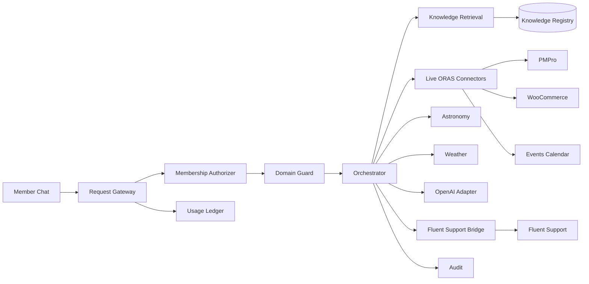
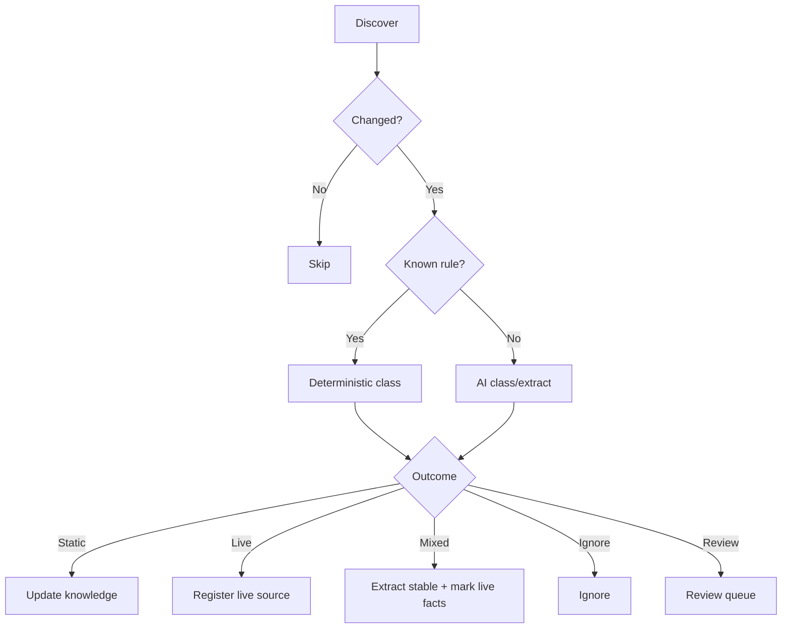

# Architecture Diagrams

## Component view

```mermaid
flowchart LR
    UI[Member Chat] --> GW[Request Gateway]
    GW --> AUTH[Membership Authorizer]
    AUTH --> DG[Domain Guard]
    DG --> ORCH[Orchestrator]
    ORCH --> RET[Knowledge Retrieval]
    RET --> KB[(Knowledge Registry)]
    ORCH --> LIVE[Live ORAS Connectors]
    LIVE --> PM[PMPro]
    LIVE --> WC[WooCommerce]
    LIVE --> TEC[Events Calendar]
    ORCH --> SKY[Astronomy]
    ORCH --> WX[Weather]
    ORCH --> OAI[OpenAI Adapter]
    ORCH --> FSB[Fluent Support Bridge]
    FSB --> FS[Fluent Support]
    GW --> UL[Usage Ledger]
    ORCH --> AUD[Audit]
```

## Ingestion view

```mermaid
flowchart TD
    D[Discover] --> H{Changed?}
    H -- No --> S[Skip]
    H -- Yes --> R{Known rule?}
    R -- Yes --> C[Deterministic class]
    R -- No --> AI[AI class/extract]
    C --> K{Outcome}
    AI --> K
    K -- Static --> KB[Update knowledge]
    K -- Live --> L[Register live source]
    K -- Mixed --> M[Extract stable + mark live facts]
    K -- Ignore --> I[Ignore]
    K -- Review --> V[Review queue]
```
