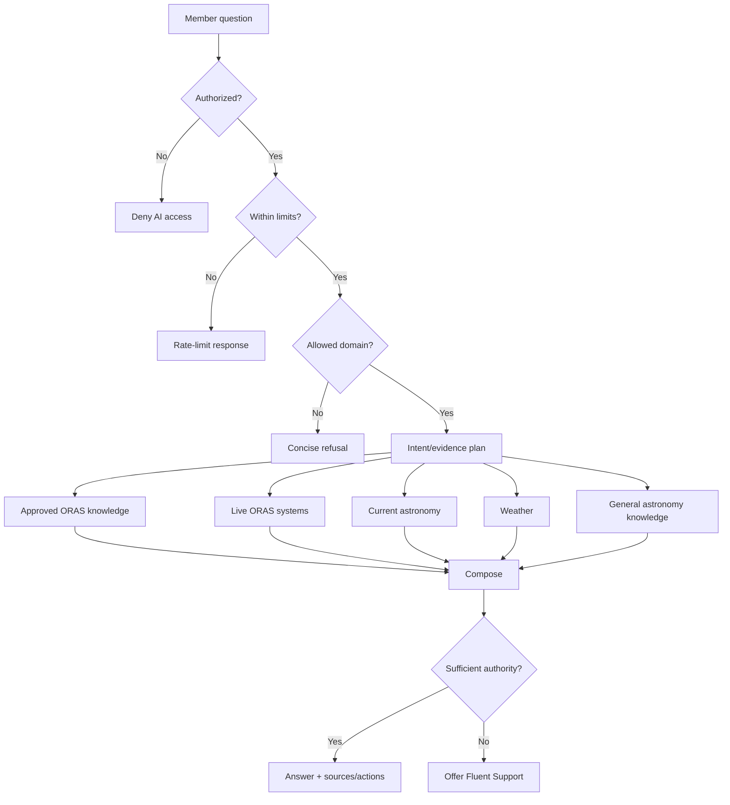

# Information Flow and Source Precedence

## Fact-level precedence

1. live ORAS structured state;
2. approved ORAS policy;
3. synchronized ORAS knowledge;
4. current astronomy/weather data;
5. general model astronomy knowledge;
6. no answer/escalation.

### Examples

If a static page and current event record disagree on AstroBlast date, the live event record wins.

If copied text and WooCommerce disagree on Observer Pass price, WooCommerce wins.

If a general model assumption conflicts with approved ORAS access rules, the ORAS rule wins.

If seasonal model knowledge says an object is "visible" but current ephemeris places it below the horizon, the calculation wins.
