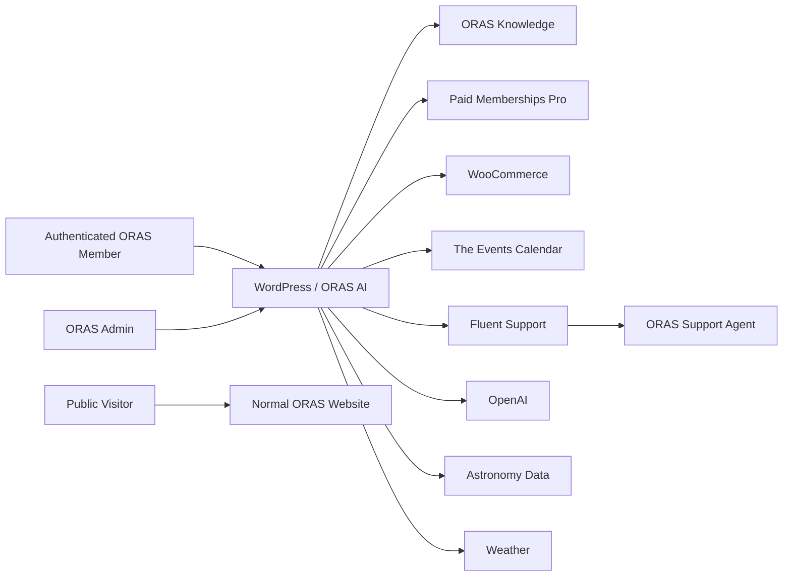

# System Context

## Actors

- **ORAS member:** authenticated user who asks allowed questions, receives observing guidance, follows ORAS links, and may request support escalation.
- **ORAS administrator:** configures knowledge, routing, limits, provider settings, and reviews health/gaps.
- **ORAS support agent/committee contact:** receives escalated questions in Fluent Support.
- **Public visitor:** uses normal ORAS website and existing non-AI contact methods; no AI chat at initial release.

## Systems

- WordPress
- ORAS AI Assistant plugin
- Paid Memberships Pro
- WooCommerce
- The Events Calendar
- Fluent Support
- OpenAI API
- astronomy/ephemeris provider or local calculation library
- weather/observing-condition provider

## Trust boundaries

1. browser ↔ WordPress;
2. WordPress ↔ OpenAI;
3. WordPress ↔ astronomy/weather services;
4. ORAS AI ↔ other WordPress plugin data;
5. ORAS AI ↔ Fluent Support;
6. admin configuration ↔ member-visible behavior.

The model never gets direct database access. It receives only server-selected evidence or tool results necessary for the authorized request.
